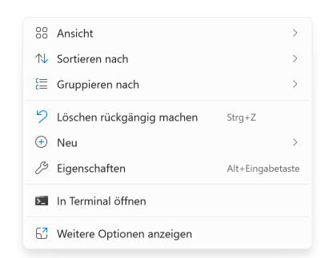
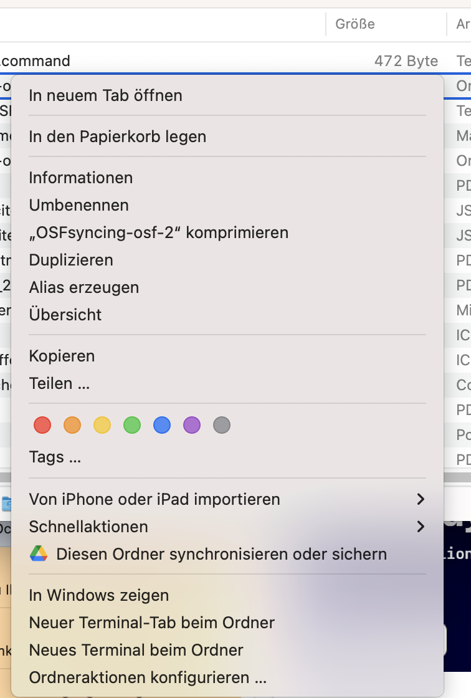

# OSF Folder Synchronization Explained

This project includes a Bash script that simplifies the use of the `osfclient` tool for synchronizing local files and those on the Open Science Framework (OSF).

## Steps to Follow:
1. **Make sure, Python is installed, including pip**

1. **Create the Initialization File:**
   Place the file `initializeOSF.command` in any folder of your choice. This folder will later contain a designated upload folder for all files to be uploaded.

3. **Run the Initialization Script:**
   Double-click the `initializeOSF.command` file. A terminal window will open, prompting you to enter your OSF username and project ID. If your comoputer doesn't allow you to open the file, open a Terminal in the folder you placed the file in, execute the following command: `bash initalizeOSF.command`

   **Windows:**
   You need to be inside the folder to right click and then open in Terminal.
   

   **Mac:**
   You need to be outside the folder, then right click on the folder and open in Terminal.
   

4. **Enter Your Credentials:**
   - Your username is your email address.
   - The project ID can be found in the URL of your project. For example, in `https://osf.io/wk5sd/`, `wk5sd` is the ID. 
   - Note that it doesn’t matter which email you provide here, as the script will prompt for the username each time to allow multiple users to utilize their own OSF accounts.

5. **File Preparation:**
   After initializing the OSF client, a folder named `hierUploaden` will be created. Place all files you want to appear in your OSF project in this folder.

6. **Upload Process:**
   Simply dropping files into the `hierUploaden` folder will not trigger an upload. The upload occurs only when you run the `updaten.command` file. For technical reasons, each file in the OSF storage will be deleted before re-uploading the files from the `hierUploaden` folder.

7. **Online Storage**
   The uploaded files will be stored in a folder called `Files` in your project.

8. **Password Security:**
   The password you are prompted to enter will not be stored in the file or on the server/folder! Once you close the terminal window, no one can access the previously entered password.

## Additional Information

For any questions or issues, feel free to reach out. Happy syncing!
